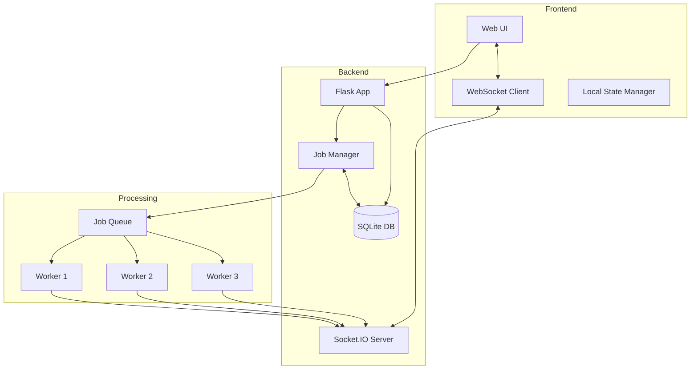
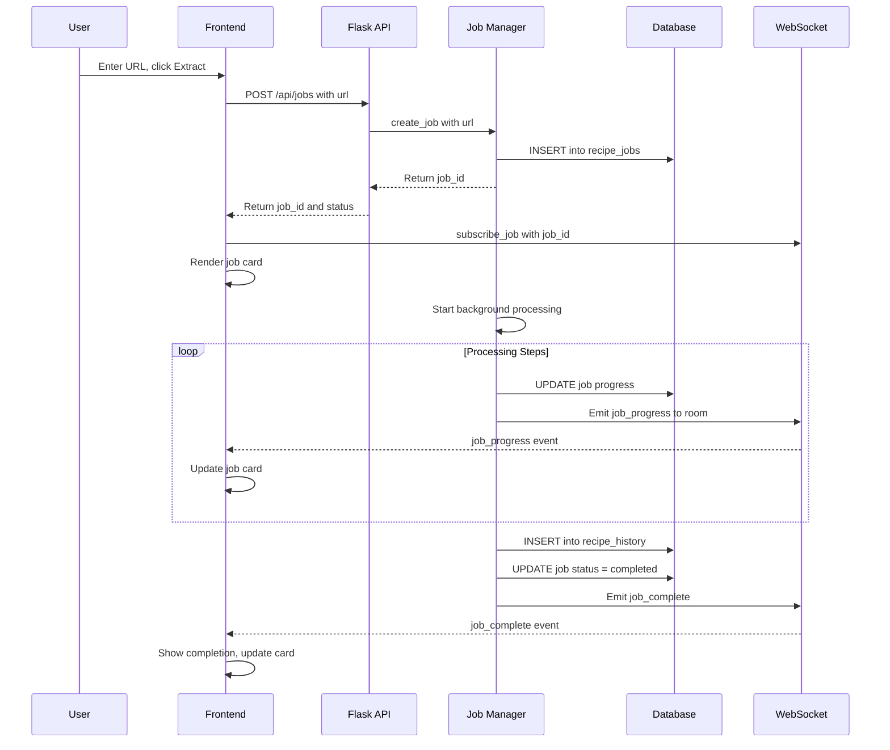
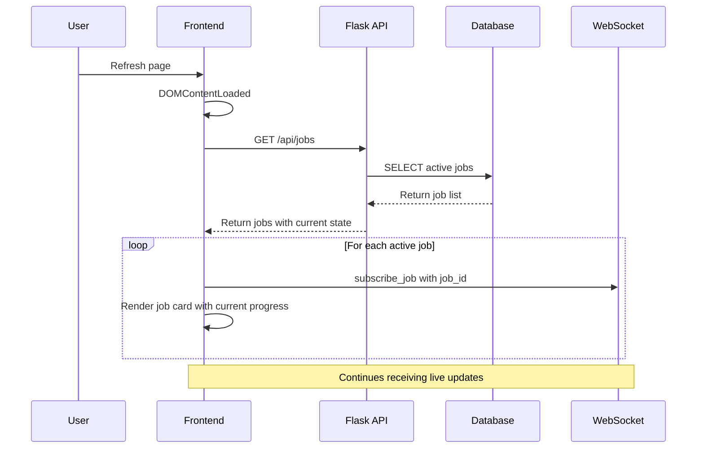

# History Tab & Parallel Analysis Implementation Plan

## Overview

This plan outlines the implementation of three key features for Social Recipes:
1. **History Tab** - View all previously analyzed recipes (including failed ones) with re-upload capability
2. **Progress Persistence** - Maintain analysis state across page refreshes
3. **Parallel Analysis** - Support 2-3 concurrent recipe analyses with individual progress trackers

---

## Architecture Diagram



---

## Database Schema

### New Tables

#### `recipe_jobs` - Active and recent analysis jobs

```sql
CREATE TABLE recipe_jobs (
    id TEXT PRIMARY KEY,           -- UUID for job identification
    url TEXT NOT NULL,             -- Source video URL
    status TEXT NOT NULL,          -- pending, downloading, transcribing, extracting, creating, uploading, completed, failed, cancelled
    progress INTEGER DEFAULT 0,    -- 0-100 percentage
    current_stage TEXT,            -- Current processing stage name
    stage_message TEXT,            -- Current stage status message
    video_title TEXT,              -- Title extracted from video
    error_message TEXT,            -- Error details if failed
    created_at TIMESTAMP DEFAULT CURRENT_TIMESTAMP,
    updated_at TIMESTAMP DEFAULT CURRENT_TIMESTAMP
);
```

#### `recipe_history` - Completed recipe records

```sql
CREATE TABLE recipe_history (
    id INTEGER PRIMARY KEY AUTOINCREMENT,
    job_id TEXT,                   -- Reference to original job
    url TEXT NOT NULL,             -- Source video URL
    video_title TEXT,              -- Video title
    recipe_name TEXT,              -- Extracted recipe name
    recipe_data TEXT,              -- Full recipe JSON
    thumbnail_path TEXT,           -- Path to stored thumbnail
    thumbnail_data TEXT,           -- Base64 thumbnail for quick display
    status TEXT NOT NULL,          -- success, failed, cancelled
    error_message TEXT,            -- Error details if failed
    output_target TEXT,            -- Where it was uploaded: tandoor, mealie
    created_at TIMESTAMP DEFAULT CURRENT_TIMESTAMP,
    FOREIGN KEY (job_id) REFERENCES recipe_jobs(id)
);
```

---

## Backend Components

### 1. Job Manager Class

Location: [`ui/job_manager.py`](ui/job_manager.py) (new file)

```python
class JobManager:
    MAX_CONCURRENT_JOBS = 3
    
    def __init__(self, socketio, db):
        self.socketio = socketio
        self.db = db
        self.active_jobs = {}  # job_id -> thread
        self.semaphore = threading.Semaphore(MAX_CONCURRENT_JOBS)
    
    def create_job(self, url) -> str:
        # Create job record in database
        # Return job_id
    
    def start_job(self, job_id):
        # Acquire semaphore (blocks if max concurrent reached)
        # Start processing thread
        # Track in active_jobs
    
    def cancel_job(self, job_id):
        # Set cancellation flag
        # Update database status
    
    def get_active_jobs(self) -> list:
        # Return list of all active/pending jobs
    
    def update_progress(self, job_id, stage, message, percent):
        # Update database
        # Emit to job-specific WebSocket room
    
    def complete_job(self, job_id, recipe_data, image_path):
        # Save to recipe_history
        # Update job status to completed
        # Release semaphore
    
    def fail_job(self, job_id, error_message):
        # Save error to recipe_history
        # Update job status to failed
        # Release semaphore
```

### 2. Updated API Endpoints

#### Job Management Endpoints

| Method | Endpoint | Description |
|--------|----------|-------------|
| `POST` | `/api/jobs` | Create new analysis job, returns job_id |
| `GET` | `/api/jobs` | List all active/pending jobs |
| `GET` | `/api/jobs/<id>` | Get specific job status |
| `DELETE` | `/api/jobs/<id>` | Cancel a running job |

#### History Endpoints

| Method | Endpoint | Description |
|--------|----------|-------------|
| `GET` | `/api/history` | List all history items with pagination |
| `GET` | `/api/history/<id>` | Get full recipe details |
| `POST` | `/api/history/<id>/reupload` | Re-upload recipe to target |
| `DELETE` | `/api/history/<id>` | Delete from history |

### 3. WebSocket Events

#### Per-Job Progress Updates

Instead of broadcasting to all clients, use Socket.IO rooms:

```python
# Server emits to job-specific room
socketio.emit('job_progress', {
    'job_id': job_id,
    'stage': stage,
    'message': message,
    'percent': percent
}, room=f'job_{job_id}')

# Client joins room for jobs they care about
@socketio.on('subscribe_job')
def handle_subscribe(data):
    join_room(f"job_{data['job_id']}")
```

---

## Frontend Components

### 1. Updated UI Layout

```
┌─────────────────────────────────────────────────────────┐
│ [Home Icon]  [History Icon]  [Settings Icon]  [Logout]  │  <- Sidebar (updated)
├─────────────────────────────────────────────────────────┤
│                                                         │
│  ┌─────────────────────────────────────────────────┐   │
│  │  [URL Input]                    [Extract Recipe] │   │
│  └─────────────────────────────────────────────────┘   │
│                                                         │
│  ┌─── Active Jobs ─────────────────────────────────┐   │
│  │                                                  │   │
│  │  ┌─────────────────────────────────────────┐    │   │
│  │  │ Job 1: TikTok video...        [Cancel]  │    │   │
│  │  │ ████████████░░░░░░░░░░░░░░ 45%          │    │   │
│  │  │ Transcribing audio...                   │    │   │
│  │  └─────────────────────────────────────────┘    │   │
│  │                                                  │   │
│  │  ┌─────────────────────────────────────────┐    │   │
│  │  │ Job 2: Instagram reel...      [Cancel]  │    │   │
│  │  │ ████████░░░░░░░░░░░░░░░░░░ 30%          │    │   │
│  │  │ Downloading video...                    │    │   │
│  │  └─────────────────────────────────────────┘    │   │
│  │                                                  │   │
│  └──────────────────────────────────────────────────┘   │
│                                                         │
└─────────────────────────────────────────────────────────┘
```

### 2. History Page Layout

```
┌─────────────────────────────────────────────────────────┐
│                    Recipe History                        │
│  ┌─────────────────────────────────────────────────┐   │
│  │ [Search...]                    [Filter: All ▼]   │   │
│  └─────────────────────────────────────────────────┘   │
│                                                         │
│  ┌─────────────────────────────────────────────────┐   │
│  │ [Thumb] Chocolate Cake Recipe                   │   │
│  │         from: tiktok.com/@chef/video/123        │   │
│  │         ✓ Uploaded to Tandoor | 2 hours ago     │   │
│  │         [View] [Re-upload ▼] [Delete]           │   │
│  └─────────────────────────────────────────────────┘   │
│                                                         │
│  ┌─────────────────────────────────────────────────┐   │
│  │ [Thumb] Pasta Recipe                            │   │
│  │         from: instagram.com/reel/abc            │   │
│  │         ✗ Failed: Network error | 1 day ago     │   │
│  │         [View] [Retry] [Delete]                 │   │
│  └─────────────────────────────────────────────────┘   │
│                                                         │
└─────────────────────────────────────────────────────────┘
```

### 3. JavaScript State Management

Location: [`ui/static/js/main.js`](ui/static/js/main.js) (updated)

```javascript
// Job state management
const jobManager = {
    activeJobs: new Map(),  // job_id -> job data
    
    // On page load, fetch active jobs from server
    async restoreState() {
        const response = await fetch('/api/jobs');
        const jobs = await response.json();
        jobs.forEach(job => {
            this.activeJobs.set(job.id, job);
            this.subscribeToJob(job.id);
            this.renderJobCard(job);
        });
    },
    
    subscribeToJob(jobId) {
        socket.emit('subscribe_job', { job_id: jobId });
    },
    
    createJob(url) {
        // POST to /api/jobs
        // Add to activeJobs
        // Subscribe to WebSocket room
        // Render job card
    },
    
    updateJobProgress(jobId, data) {
        // Update job in activeJobs
        // Update UI
    },
    
    removeJob(jobId) {
        // Remove from activeJobs
        // Remove UI element
    }
};

// Initialize on page load
document.addEventListener('DOMContentLoaded', () => {
    jobManager.restoreState();
});
```

---

## Data Flow

### Starting a New Analysis



### Page Refresh Recovery



---

## File Changes Summary

### New Files
- [`ui/job_manager.py`](ui/job_manager.py) - Job management class
- [`ui/templates/history.html`](ui/templates/history.html) - History page template

### Modified Files
- [`ui/database.py`](ui/database.py) - Add new tables and CRUD functions
- [`ui/app.py`](ui/app.py) - Add new API endpoints and WebSocket handlers
- [`ui/static/js/main.js`](ui/static/js/main.js) - Multi-job handling and state restoration
- [`ui/templates/index.html`](ui/templates/index.html) - Multi-job progress UI
- [`ui/templates/base.html`](ui/templates/base.html) - Add History link to sidebar
- [`ui/static/css/style.css`](ui/static/css/style.css) - Styles for job cards and history

---

## Implementation Order

1. **Database changes** - Add tables first as foundation
2. **Job Manager** - Core backend logic for job tracking
3. **API endpoints** - Expose job and history functionality
4. **WebSocket updates** - Per-job progress channels
5. **Frontend job cards** - Multi-job UI on home page
6. **State restoration** - Handle page refresh
7. **History page** - Full history view with re-upload
8. **Polish & testing** - CSS, edge cases, testing

---

## Configuration

Add to config if needed:

```python
MAX_CONCURRENT_JOBS = 3  # Maximum parallel analyses
JOB_TIMEOUT_MINUTES = 30  # Auto-fail stuck jobs
HISTORY_RETENTION_DAYS = 90  # Optional cleanup
```

---

## Notes

- **Image Storage**: Thumbnails are stored as base64 in database for simplicity. For production with many recipes, consider file storage.
- **Job Cleanup**: Consider a background task to clean up old/stuck jobs.
- **Concurrency**: Using `threading.Semaphore` to limit concurrent jobs. The existing `socketio.start_background_task` approach works well with this.
